# TP1DPBO2526C2
# Tugas Praktikum 1 - Desain dan Pemrograman Berbasis Objek (DPBO)

[](https://isocpp.org/)
[](https://www.java.com/)
[](https://www.python.org/)
[](https://www.php.net/)

---

## 📌 Janji
> Saya Moch Fadillah Pratama dengan NIM 2506968 mengerjakan Tugas Praktikum 1 dalam mata kuliah Desain dan Pemrograman Berbasis Objek untuk keberkahan-Nya maka saya tidak melakukan kecurangan seperti yang telah dispesifikasikan. Aamiin.

---

## 🎬 Deskripsi Program
Program ini merupakan aplikasi pengelolaan data bioskop berbasis Object-Oriented Programming (OOP) sederhana yang diimplementasikan dalam 4 bahasa pemrograman yaitu **C++**, **Java**, **Python**, dan **PHP**. 

Program dapat mengelola *array/list of objects* untuk entitas **`Studio`** melalui fitur utama CRUD (Create, Read, Update, Delete) serta pencarian data (*Search*):
1. **Tambah Data Studio (Create):** Menambahkan data studio bioskop baru ke dalam daftar.
2. **Tampilkan Data Studio (Read):** Menampilkan seluruh daftar studio bioskop yang tersimpan.
3. **Update Data Studio (Update):** Mengubah data studio bioskop berdasarkan `idStudio`.
4. **Hapus Data Studio (Delete):** Menghapus data studio bioskop dari daftar berdasarkan `idStudio`.
5. **Cari Data Studio (Search):** Mencari studio bioskop tertentu berdasarkan kriteria unik (`idStudio` / `namaStudio`).

---

## 📐 Desain Class & Atribut

Sistem menggunakan 1 class tunggal yaitu **`Studio`** yang merepresentasikan studio bioskop.

### **Class: `Studio`**

#### **Atribut:**
| Nama Atribut | Tipe Data | Deskripsi | Berlaku Di |
| :--- | :--- | :--- | :--- |
| `idStudio` | String | Identifier / ID unik untuk setiap studio (misal: `STD-01`) | C++, Java, Python, PHP |
| `namaStudio` | String | Nama studio bioskop (misal: `Studio 1 - Regular`, `IMAX Hall`) | C++, Java, Python, PHP |
| `jenisLayar` | String | Tipe/teknologi layar (misal: `2D`, `3D`, `IMAX`, `4DX`) | C++, Java, Python, PHP |
| `kapasitasKursi` | Integer / Int | Jumlah total kapasitas kursi di dalam studio | C++, Java, Python, PHP |
| `hargaTiket` | Integer / Double | Harga tiket masuk studio per orang (dalam Rp) | C++, Java, Python, PHP |
| `gambar` | String | Path/URL file gambar lokal pendukung studio | **Khusus PHP** |

#### **Method Utama:**
- **Constructor:** Menginisialisasi objek `Studio` baru dengan nilai awal.
- **Getter & Setter:** Mengakses dan mengubah nilai atribut privat/terenkapsulasi.

---

## 🔄 Alur & Flow Kode Program

### **1. Implementasi CLI (C++, Java, Python)**
- **Menu Interaktif:** Program berjalan dalam perulangan (*looping*) terminal hingga pengguna memilih opsi *Exit*.
- **Penyimpanan Memory:** Seluruh objek `Studio` disimpan ke dalam struktur data dinamis (*Array/List/Vector of Objects*).
- **Alur Menu:**
  1. **Menu 1 (Tambah):** Pengguna menginputkan data studio -> Objek `Studio` dibuat -> Dimasukkan ke dalam List/Vector.
  2. **Menu 2 (Tampilkan):** Program mengiterasi List/Vector dan menampilkan seluruh atribut `Studio` dalam format tabel CLI.
  3. **Menu 3 (Update):** Pengguna memasukkan `idStudio` -> Program mencari objek -> Jika ditemukan, pengguna memasukkan data baru untuk memperbarui nilai atribut.
  4. **Menu 4 (Hapus):** Pengguna memasukkan `idStudio` -> Program mencari posisi objek -> Menghapus objek dari List/Vector.
  5. **Menu 5 (Cari):** Pengguna memasukkan kata kunci -> Program menampilkan data `Studio` yang cocok.

### **2. Implementasi Web (PHP)**
- **Tanpa Database:** Data disimpan sementara secara in-memory dalam sesi (*Session*) atau array lokal selama request berjalan.
- **Form HTML & Tabel Display:**
  - Halaman menampilkan tabel daftar `Studio` beserta tampilan gambar pendukung dari atribut `gambar`.
  - Terdapat form input HTML untuk menambahkan data studio baru (termasuk upload/input path gambar lokal).
  - Terdapat tombol/link aksi **Edit** dan **Delete** untuk memproses manipulasi data `Studio`.
---

## 📁 Struktur Folder Repositori

```text
TP1DPBO2526C2/
│
├── CPP/
│   ├── main.cpp
│   └── Studio.cpp
│
├── Python/
│   ├── main.py
│   └── Studio.py
│
├── Java/
│   ├── Main.java
│   └── Studio.java
│
├── PHP/
│   ├── assets/
│   │   └── images/
│   │       ├── default.jpg
│   │       ├── studio1.jpg
│   │       └── studio2.jpg
│   ├── uploads/
│   ├── index.php
│   ├── Studio.php
│   └── style.css
│
├── Dokumentasi/
│   ├── cpp_output/
│   ├── java_output/
│   ├── python_output/
│   └── php_output/
│
└── README.md
```

---

## 📸 Dokumentasi Program Berjalan

Berikut adalah bukti dokumentasi tangkapan layar/screenrecord dari masing-masing bahasa pemrograman saat program berhasil dijalankan:

### A. C++ (CLI Output)
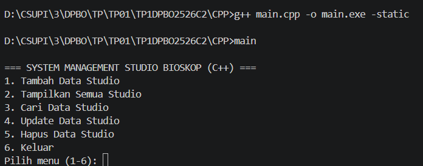

#### 1. Tambah Data
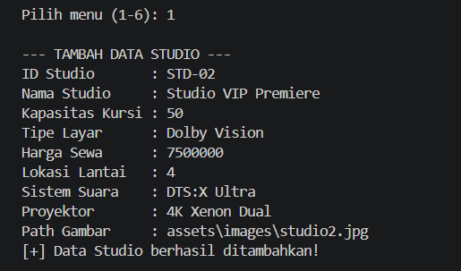

#### 2. Tampilkan Data
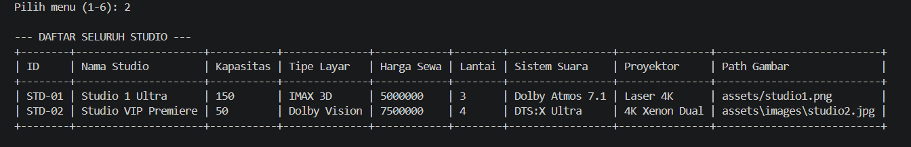

#### 3. Cari Data
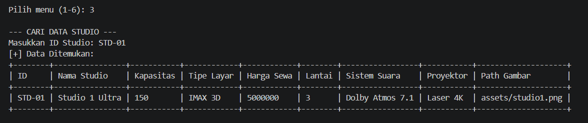

#### 4. Update Data
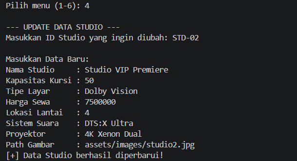

#### 5. Hapus Data
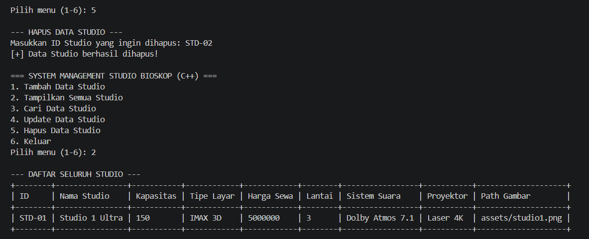


### B. Java (CLI Output)
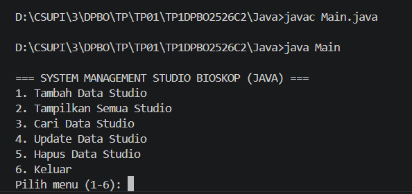

#### 1. Tambah Data
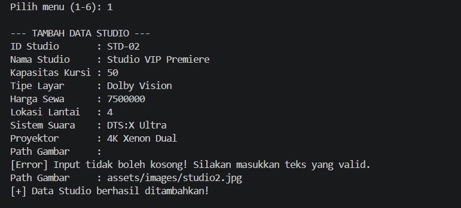

#### 2. Tampilkan Data
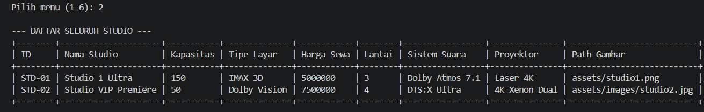

#### 3. Cari Data
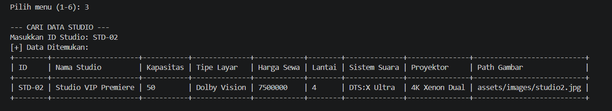

#### 4. Update Data
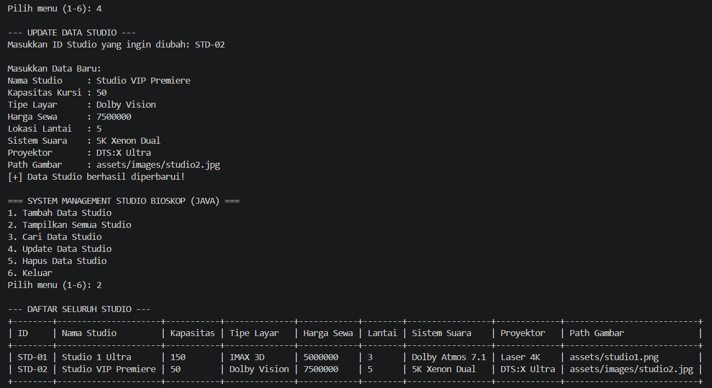

#### 5. Hapus Data
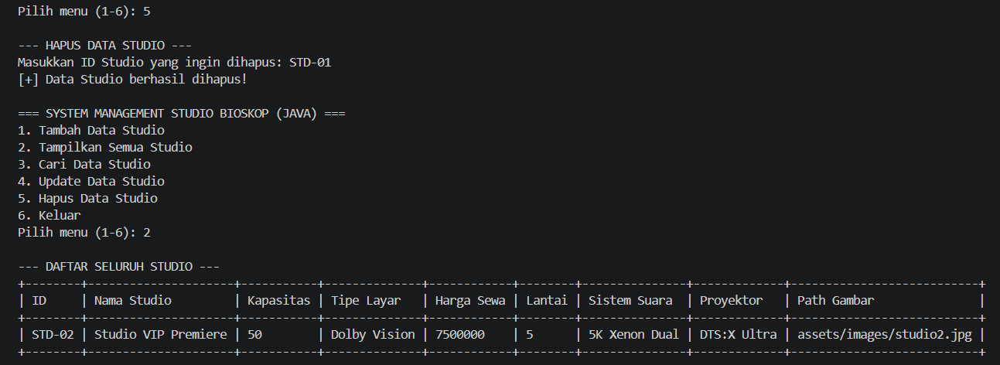


### C. Python (CLI Output)
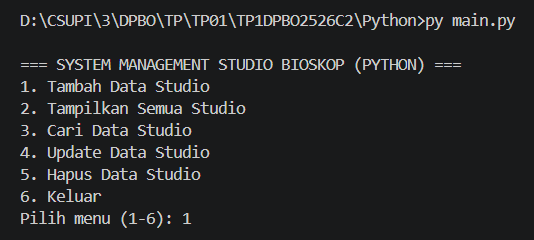

#### 1. Tambah Data
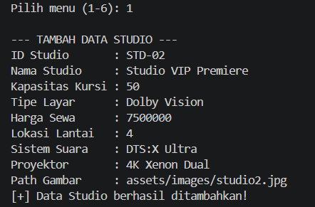

#### 2. Tampilkan Data
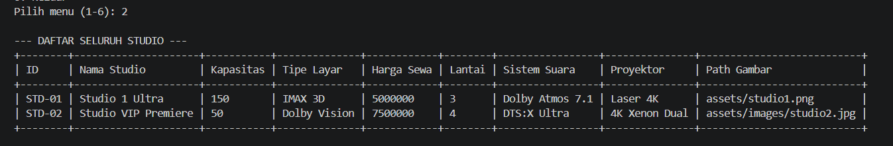

#### 3. Cari Data
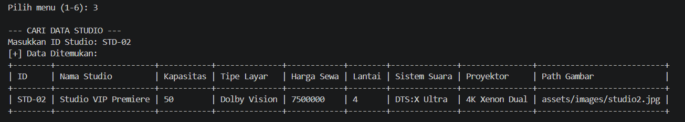

#### 4. Update Data
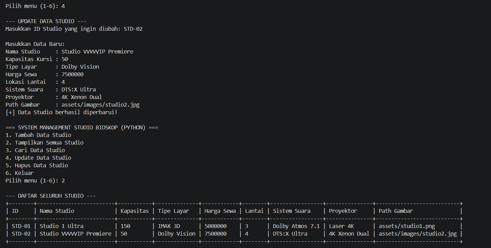

#### 5. Hapus Data
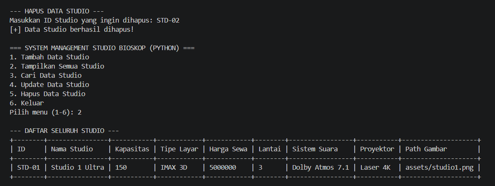


### D. PHP (Web Output)
#### 1. Tambah Data
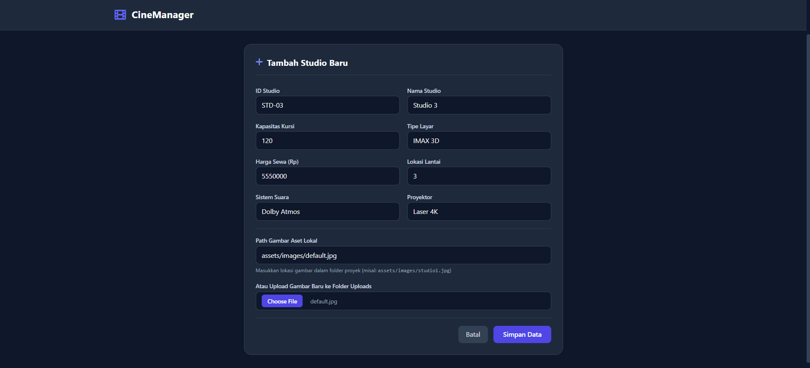

#### 2. Tampilkan Data
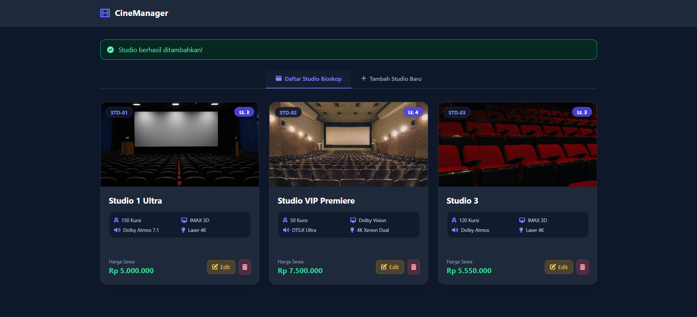

#### 3. Update Data
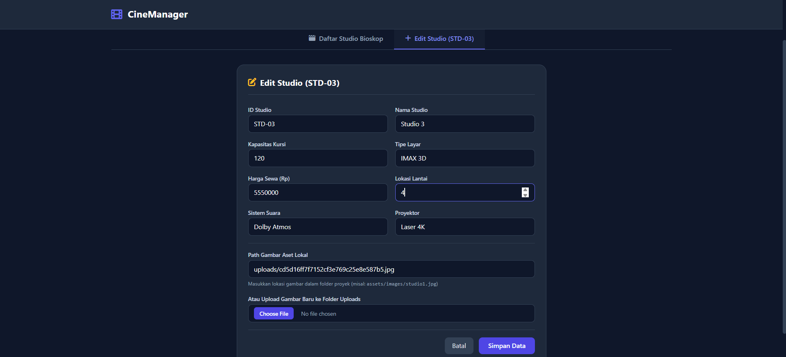
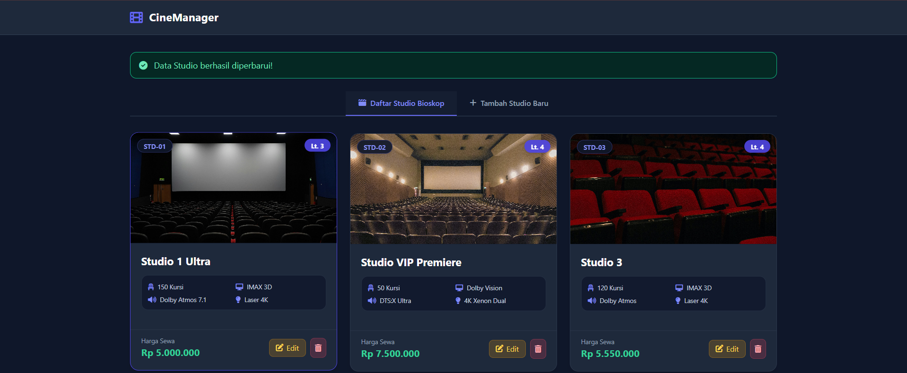

#### 4. Hapus Data

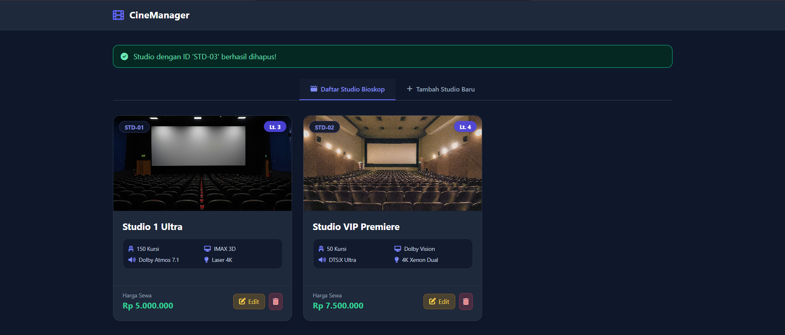
